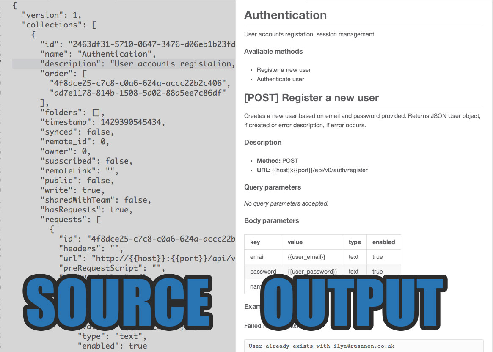

# Docman

Docs generator for [Postman REST Client](https://www.getpostman.com/). Docman parses Postman dump files and outputs documentation as set of Markdown files.

# Install

Install Docman globally:

    npm install -g docman

# Usage

Docman takes two arguments:

* **`dump`:** file path to Postman JSON dump file (in Postman Settings -> Data -> Export data)
* **`dir`:** output directory where Docman should generate docs. If provided directory is not writable, Docman will try to generate docs to `./docs`

Syntax:

    docman <dump> <dir>

Example:

    docman ./Backup.postman_dump /Users/me/myapp/api_docs

# Developing Docman

Docman bundles Dockerfile for building working development environment. Assuming you have installed [Docker](http://docker.io), from Docman clonned directory type:

    # build image (only once for each Dockerfile)
    docker build -t <namespace>/docman.dev:0.1 .

    # run container (anytime to start dev)
    docker run -it --rm -v `pwd`:/src <namespace>/docman.dev:0.1

This will build and run development container, that will delete itself after exiting. Sources are mounted to `/src`. To install current code as global module (for testing puporse) use:

    npm install -g .

Then command `docman` will run latest code version.

# License

Copyright (c) 2015, Ilya Rusanen. (MIT License)

See LICENSE for more info.
